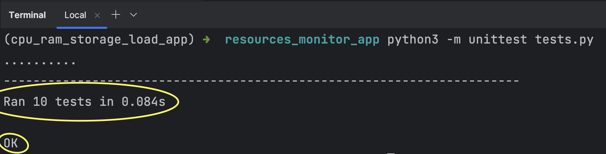
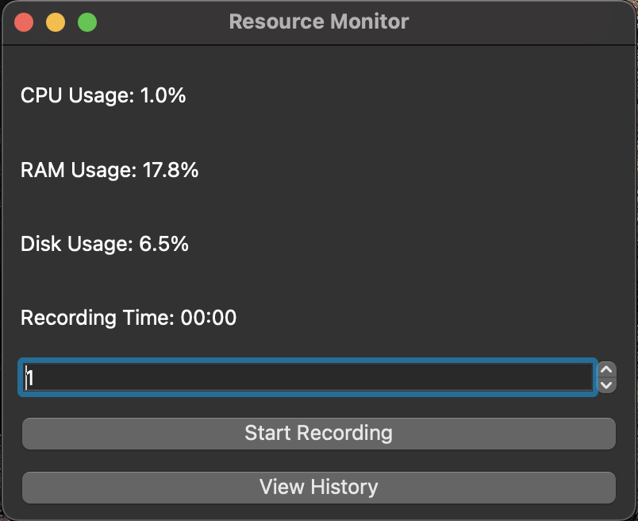
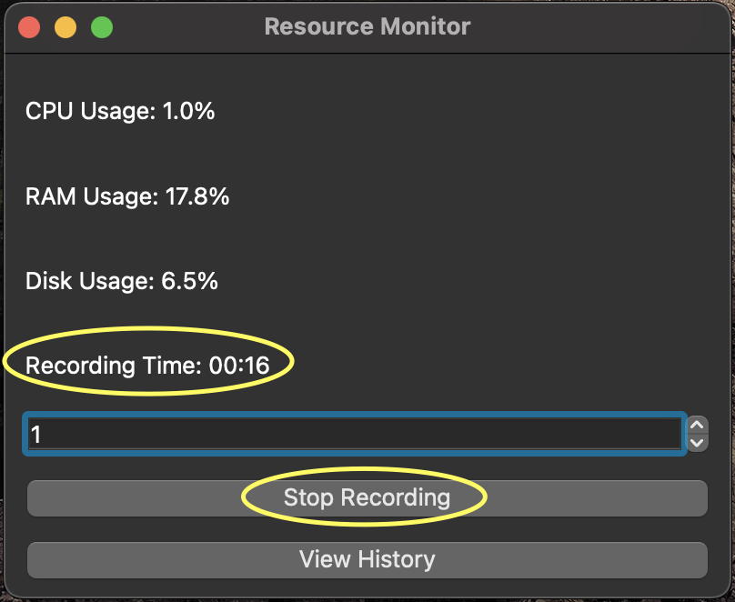
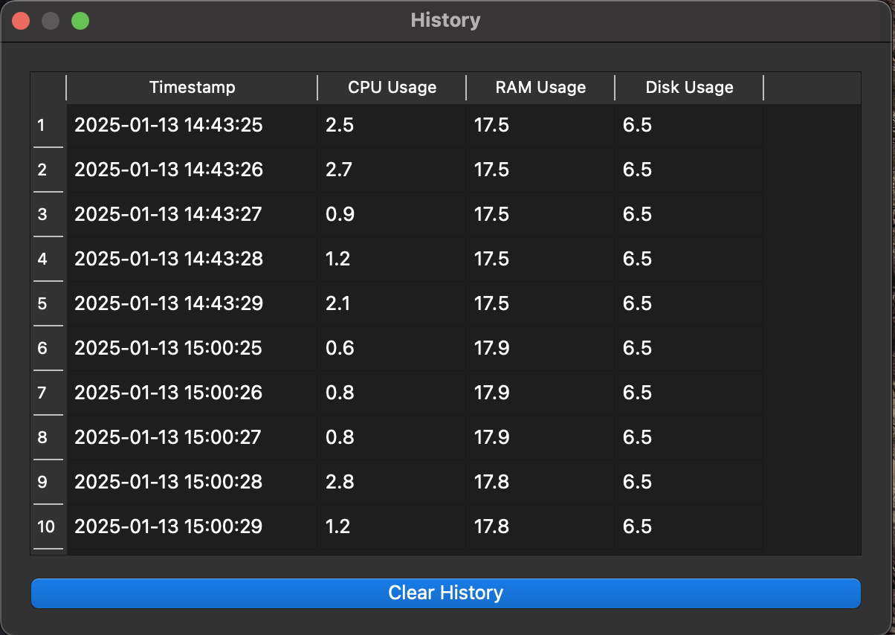

# Resource Monitor

Программа для мониторинга использования ресурсов компьютера (CPU, RAM, Disk) с возможностью записи данных в базу данных SQLite и просмотра истории через графический интерфейс.

---

## Возможности

- **Мониторинг ресурсов**:
  Отображение текущей загрузки CPU, оперативной памяти (RAM) и использования дискового пространства.
- **Запись данных**:
  Сохранение данных в базу SQLite для дальнейшего анализа.
- **История данных**:
  Просмотр записанных данных через интерфейс приложения.
- **Возможность удаления истории данных**:
  Удаление записанных данных через интерфейс приложения.
- **Настройка интервала обновления**:
  Регулируемый интервал (1–60 секунд) для обновления данных.

---

## Установка

### Требования
- Python 3.10+
- ОС: Windows, macOS или Linux

### Шаг 1: Клонируйте репозиторий
```bash
git clone https://github.com/easyflygit/resources_monitor_app.git
cd resources-monitor_app
```

### Шаг 2: Установите зависимости
```bash
python -m pip install --upgrade pip
pip install -r requirements.txt
````

### Шаг 3: Запустите приложение
```bash
python3 resource_monitor.py
```

## Инструкция по работе

### Основные функции:

- **Запуск мониторинга**:
  Запустите приложение и наблюдайте за текущей загрузкой ресурсов.
- **Запись данных**:
  - Нажмите кнопку `Start Recording`, чтобы начать запись данных.
  - Для остановки записи нажмите `Stop Recording`.
- **Просмотр истории**:
  - Нажмите `View History`, чтобы открыть окно с историей.
  - Используйте кнопку `Clear History` для удаления всех записей.
- **Настройка интервала обновления**:
  Выберите интервал (в секундах) с помощью спиннера в главном окне.

## Тестирование
- Программа протестирована с помощью unittest

### Шаг 1: Запустите тестирование
```bash
python3 -m unittest tests.py
```
Тесты пройдены удачно



## Скриншоты программы
Главное окно


Запись в БД, запуск таймера, отображение кнопки Stop Recording


Обзор истории



## Структура проекта
```plaintext
resources_monitor_app/
├── resource_monitor.py           # Основной файл приложения
├── requirements.txt  # Список зависимостей
├── README.md         # Инструкция
├── tests.py         # Тесты
├── screenshots/      # Папка для скриншотов
│   ├── view_history.png
│   ├── resource_monitor.png
│   ├── recording_time_and_stop_recording_button.png
│   └── tests_OK.png
└── resources.db      # База данных (генерируется автоматически)
```

Разработчик
- **Имя**: Артур Колесников
- **Контакты**: akv888@inbox.ru